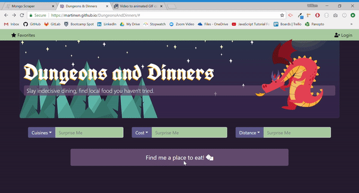

# Dungeons And Dinners
A dining application that offers local food suggestions. Users can set parameters like distance and cuisine type to filter results. They can also sign in with third party authentication to save favorites.

(Deployed Here)[https://martinwn.github.io/DungeonsAndDinners/]

## Demo

## Built With
* HTML/CSS/Javascript/JQuery
* Ajax
* Firebase
* Google & Zomato API

### Contributors
William Martin, Andrew Babb, Garrett Berry.
